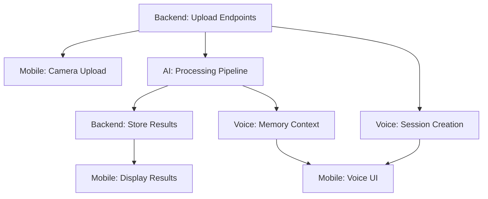

# Team Workflow - 4 Person Split
## NexHacks 2026 - Stash Project

> **Timeline:** 24 hours (January 17-18, 2026)  
> **Team Size:** 4 people  
> **Goal:** Build visual AI memory assistant with voice interaction

---

## 👥 Team Roles & Responsibilities

### Person 1: Backend Lead (API & Infrastructure)
**Primary Focus:** Core backend services, database, storage

**Responsibilities:**
- Set up Fastify backend server
- Configure MongoDB + Cloudflare R2 storage
- Implement upload endpoints (presigned URLs)
- Set up Bull Queue + Redis for job processing
- **Implement autonomous reminder system (cron jobs)**
- Deploy backend to Vercel/Railway
- Environment configuration & secrets management

**Key Deliverables:**
- `/api/upload/presigned` - Generate upload URLs
- `/api/upload/complete` - Trigger processing
- `/api/captures/:id` - Retrieve capture data
- `/api/voice/session` - Create LiveKit sessions
- **Scheduled jobs: morning briefings, event reminders, smart suggestions**
- **Push notification service integration (FCM/APNS)**
- MongoDB schema & indexes
- R2 bucket configuration

**Timeline:**
- Hours 0-3: Project setup, database, storage
- Hours 3-6: Upload endpoints, queue setup
- Hours 6-12: Voice session endpoints, testing
- Hours 12-16: **Autonomous reminder cron jobs**
- Hours 16-18: Integration support, bug fixes
- Hours 18-24: Deployment, monitoring

---

### Person 2: AI Processing Lead (Vision & Memory)
**Primary Focus:** GPT-4V integration, video processing, Supermemory

**Responsibilities:**
- Implement visual analysis pipeline (photos + videos)
- Set up ffmpeg frame extraction
- Integrate GPT-4 Vision API via Supermemory
- Implement Whisper audio transcription
- Build processing queue workers
- Optimize prompt engineering for best results

**Key Deliverables:**
- `processPhoto()` - Analyze static images
- `processVideo()` - Extract frames + analyze
- `extractAndTranscribeAudio()` - Audio processing
- Supermemory integration & memory storage
- Processing queue worker logic
- JSON response parsing & validation

**Timeline:**
- Hours 0-2: Set up OpenAI + Supermemory
- Hours 2-6: Photo analysis pipeline
- Hours 6-12: Video frame extraction + analysis
- Hours 12-16: Audio transcription integration
- Hours 16-20: Prompt optimization, testing
- Hours 20-24: Performance tuning, edge cases

---

### Person 3: Mobile Lead (React Native App)
**Primary Focus:** Camera interface, upload flow, UI/UX

**Responsibilities:**
- Initialize Expo React Native app
- Build camera capture interface (photo + video)
- Implement upload to R2 via presigned URLs
- Create capture preview components
- Build memory gallery/timeline view
- Handle permissions (camera, microphone, storage)

**Key Deliverables:**
- Camera screen with photo/video capture
- Upload progress indicators
- Capture preview with analysis results
- Memory timeline/gallery view
- Navigation structure
- Loading states & error handling

**Timeline:**
- Hours 0-2: Expo setup, camera permissions
- Hours 2-6: Camera UI, capture functionality
- Hours 6-10: Upload flow, progress tracking
- Hours 10-14: Preview components, gallery
- Hours 14-18: Polish UI, animations
- Hours 18-24: Testing, bug fixes, demo prep

---

### Person 4: Voice Agent Lead (LiveKit Integration)
**Primary Focus:** Real-time voice interaction, chat interface

**Responsibilities:**
- Set up LiveKit server & client SDKs
- Implement voice agent backend logic
- Build mobile chat/voice interface
- Integrate with Supermemory for context
- Handle real-time audio streaming
- Implement text-to-speech responses

**Key Deliverables:**
- LiveKit room creation & management
- Voice agent backend (transcription + response)
- Mobile voice chat UI
- Real-time audio session handling
- Conversation transcript display
- Voice activity indicators

**Timeline:**
- Hours 0-4: LiveKit setup, basic room creation
- Hours 4-8: Voice agent backend logic
- Hours 8-12: Mobile voice UI integration
- Hours 12-16: Supermemory context integration
- Hours 16-20: Polish conversation flow
- Hours 20-24: Testing, demo scenarios

---

## 🔄 Integration Points & Dependencies

### Critical Path Dependencies

### Hour-by-Hour Sync Points

**Hour 3:** Backend upload endpoints ready → Mobile can start testing uploads  
**Hour 6:** AI photo processing working → Backend can trigger processing  
**Hour 8:** LiveKit sessions working → Mobile can integrate voice  
**Hour 12:** All core features integrated → Begin end-to-end testing  
**Hour 18:** Feature freeze → Focus on polish & demo  
**Hour 22:** Demo rehearsal → Final bug fixes  

---

## 📋 Shared Responsibilities

### Everyone (15 min each, Hour 0)
- Clone repo, install dependencies
- Set up environment variables
- Review architecture diagram
- Join team communication channel

### Integration Testing (Hours 12-18)
- **Backend + Mobile:** Upload flow testing
- **AI + Backend:** Processing pipeline validation
- **Voice + Mobile:** Real-time chat testing
- **All:** End-to-end user flow testing

### Demo Preparation (Hours 18-24)
- **Person 1:** Ensure backend is deployed & stable
- **Person 2:** Prepare demo data (sample images/videos)
- **Person 3:** Polish UI, prepare demo device
- **Person 4:** Test voice interaction scenarios

---

## 🛠️ Technology Stack (Reference)

| Component | Technology | Owner |
|-----------|-----------|-------|
| Backend API | Fastify (Node.js) | Person 1 |
| Database | MongoDB | Person 1 |
| Storage | Cloudflare R2 | Person 1 |
| Queue | Bull + Redis | Person 1 |
| Vision AI | GPT-4V + Supermemory | Person 2 |
| Video Processing | ffmpeg + fluent-ffmpeg | Person 2 |
| Audio Transcription | OpenAI Whisper | Person 2 |
| Mobile App | React Native (Expo) | Person 3 |
| Voice Agent | LiveKit | Person 4 |
| Real-time Voice | WebRTC | Person 4 |

---

## 📞 Communication Protocol

### Standup Schedule
- **Hour 0:** Kickoff, assign roles, set up environment
- **Hour 6:** First sync - upload & processing working?
- **Hour 12:** Midpoint - integration status check
- **Hour 18:** Feature freeze - begin polish phase
- **Hour 22:** Demo rehearsal - final testing

### Slack/Discord Channels
- `#general` - Team coordination
- `#backend` - API & infrastructure
- `#ai-processing` - Vision & memory
- `#mobile` - React Native app
- `#voice` - LiveKit integration
- `#blockers` - Urgent issues

### Code Review
- Quick PR reviews (< 30 min turnaround)
- Focus on integration points, not perfection
- Use feature branches, merge to `main` frequently

---

## 🎯 Success Metrics

### Minimum Viable Demo (Hour 18)
- ✅ Capture photo via mobile app
- ✅ Photo uploads to R2
- ✅ GPT-4V analyzes image (OCR + objects)
- ✅ Results display in mobile app
- ✅ Voice chat about the captured image works

### Stretch Goals (Hour 24)
- ✅ Video capture & processing
- ✅ Audio transcription for videos
- ✅ Memory timeline/gallery view
- ✅ Semantic search via voice
- ✅ Calendar event creation from captures
- ✅ **Morning briefing notifications**
- ✅ **Event-based reminders**

---

## 🚨 Risk Mitigation

### Common Blockers & Solutions

| Risk | Mitigation | Owner |
|------|-----------|-------|
| R2 upload fails | Test with small files first, implement retry logic | Person 1 |
| GPT-4V rate limits | Implement queue with rate limiting, use caching | Person 2 |
| ffmpeg not installed | Use Docker container or ffmpeg-static npm package | Person 2 |
| LiveKit connection issues | Test with simple echo bot first, check firewall | Person 4 |
| Mobile permissions denied | Implement graceful error handling, clear prompts | Person 3 |
| Supermemory API errors | Add fallback to direct OpenAI API | Person 2 |

### Backup Plans
- **If video processing too complex:** Focus on photos only, add video as stretch
- **If LiveKit too hard:** Implement text chat first, voice as bonus
- **If Supermemory issues:** Use direct GPT-4 API without persistent memory

---

## 📦 Deliverables Checklist

### Hour 12 Checkpoint
- [ ] Backend deployed & accessible
- [ ] Mobile app runs on physical device
- [ ] Photo upload → analysis → display works end-to-end
- [ ] Voice session can be created

### Hour 18 Checkpoint (Feature Freeze)
- [ ] Video processing working
- [ ] Voice chat functional
- [ ] Memory retrieval via voice
- [ ] UI polished & responsive
- [ ] Error handling implemented

### Hour 24 Final
- [ ] Demo video recorded (5 min)
- [ ] README with setup instructions
- [ ] All code pushed to GitHub
- [ ] Backend deployed & stable
- [ ] Demo device ready with test data
- [ ] Presentation slides prepared

---

## 🎬 Demo Script (5 Minutes)

**[0:00-0:30] Problem**
- Show cluttered photo library
- Demonstrate forgotten screenshots
- "We capture moments but never revisit them"

**[0:30-2:00] Solution Demo**
- Open Stash app
- Capture photo of whiteboard notes
- Voice: "Save this for my meeting next week"
- Show AI analysis results
- Calendar event auto-created

**[2:00-3:30] Voice Interaction**
- Ask: "What did I capture about the meeting?"
- AI retrieves memory, shows photo
- Ask: "Remind me to review this tomorrow"
- Confirmation shown

**[3:30-4:30] Video Demo**
- Capture short video (recipe, lecture)
- Show frame extraction + analysis
- Audio transcription displayed
- Tags auto-generated

**[4:30-5:00] Impact**
- "Visual memory that thinks"
- "Talk to your past"
- "Never forget again"

---

## 💡 Tips for Success

1. **Start simple, iterate fast** - Get basic flow working first
2. **Test integration points early** - Don't wait until hour 12
3. **Use mock data** - Don't block on API responses
4. **Commit frequently** - Push working code often
5. **Communicate blockers immediately** - Don't struggle alone
6. **Focus on demo flow** - Polish what judges will see
7. **Keep backup plans ready** - Have fallbacks for risky features

---

## 📊 Hour-by-Hour Breakdown

| Hour | Backend | AI Processing | Mobile | Voice |
|------|---------|---------------|--------|-------|
| 0-2 | Setup, DB, R2 | OpenAI setup | Expo init | LiveKit setup |
| 2-4 | Upload endpoints | Photo analysis | Camera UI | Room creation |
| 4-6 | Queue setup | Video frames | Upload flow | Agent backend |
| 6-8 | Voice endpoints | Audio transcription | Preview UI | Mobile integration |
| 8-10 | Testing | Prompt optimization | Gallery view | Context integration |
| 10-12 | Integration | Edge cases | Polish UI | Conversation flow |
| 12-14 | Bug fixes | Performance | Testing | Testing |
| 14-16 | Deployment | Caching | Animations | Polish |
| 16-18 | Monitoring | Final testing | Demo prep | Demo scenarios |
| 18-20 | Support | Support | Demo rehearsal | Demo rehearsal |
| 20-22 | Final fixes | Final fixes | Final polish | Final testing |
| 22-24 | Demo support | Demo support | Demo ready | Demo ready |

---

**Let's build something amazing! 🚀**
